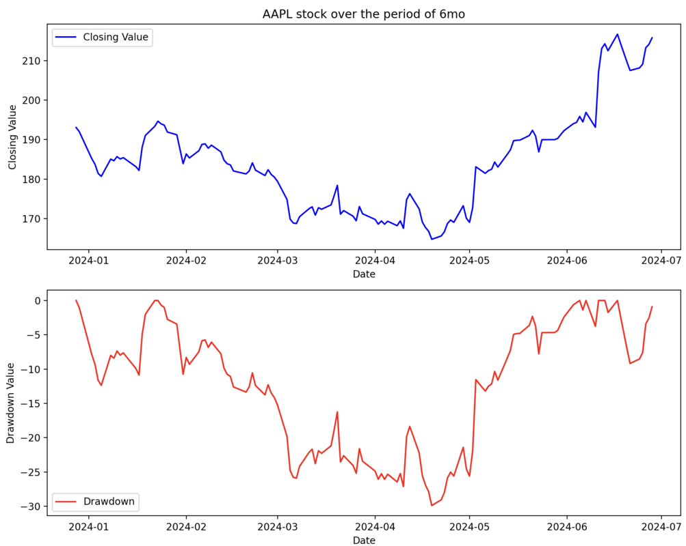

# GEN AI AGENT Financial tracker

## Description

This project creates a chat box that will give you up to date financial tracking for a specific stock. This will be brought back in a graph format including the stock value and the drawdown for the stock


## Requirements
1. install python : https://www.python.org/downloads/
2. [Optional] create a virtual environment:
    - run the commands: 
        ```
            pip install virtualenv` or `pip3 install virtualenv
            virtualenv my_env
            ```
    - on mac and linux: `source my_env/bin/activate`
    - on windows: `.\my_env\Scripts\activate`
    2. install the requirements
            `pip install -r requirements.txt`
    3. Create a file `.env`
        - run the command: 
             `cp .env.sample .env`
        - open the `.env` file and add your OpenAI api key: https://platform.openai.com/api-keys
        


## Usage
1. run the command 
    `python app.py` or `python3 app.py`
2. The system will ask you for an input like:
    e.g `user:> Get me details on NVIDIA`
3. The system will run a genAI agent that will do the required calls to retrive you the graph breakdown. 
    

## Agent step by step
The agent will:
1. Retrieve the ticker name (e.g. Give me details on Apple will return the value of AAPL) and the period (default 1 year) -> plugin: ChatPlugin
2. The agent will then call some code to retrieve the Yahoo finance details for the ticker -> plugin: FinancePlugin; function financial_info
3. The next action will  be for the agent to calculate the drawdown for the stock -> plugin: FinancePlugin; function: drawdown
4. The agent will generate a dynamic code that will give us the template to plot the data on a graph -> plugin ChartPlugin
5. The agent will call a code function to add the data to be plotted as well as the title -> plugin CodePlugin; function: refactor

We call this code locally to display the graph
